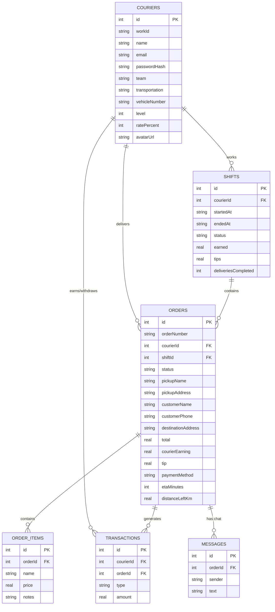

# Data Model / ERD

**Why SQLite for this assessment:** the delivery-buddy app's data (couriers, shifts,
orders, wallet transactions) is inherently relational — orders belong to couriers,
transactions belong to orders, etc. SQLite gives that relational structure with zero
setup cost (no separate DB server to run/host), which matters given the assessment's
timeframe. For production, this schema would map directly onto Postgres.
